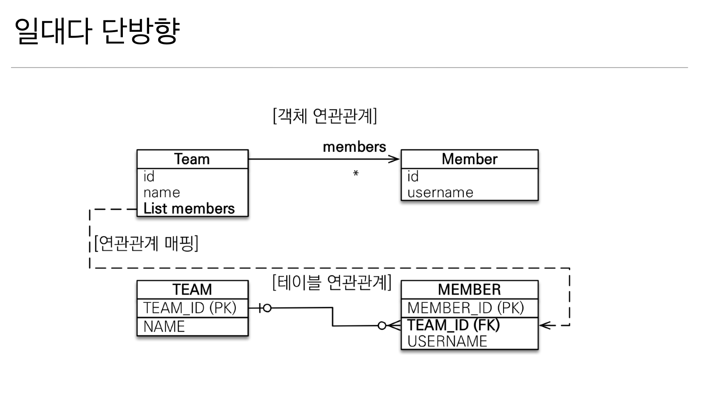
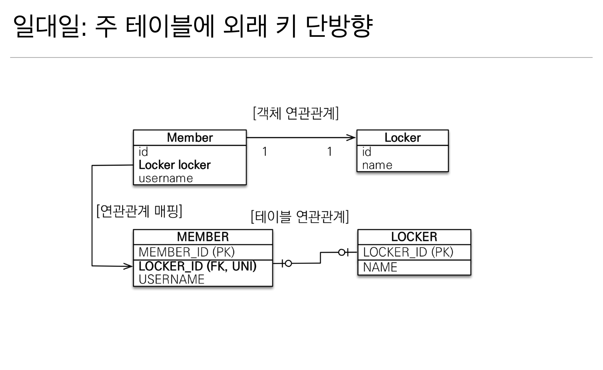
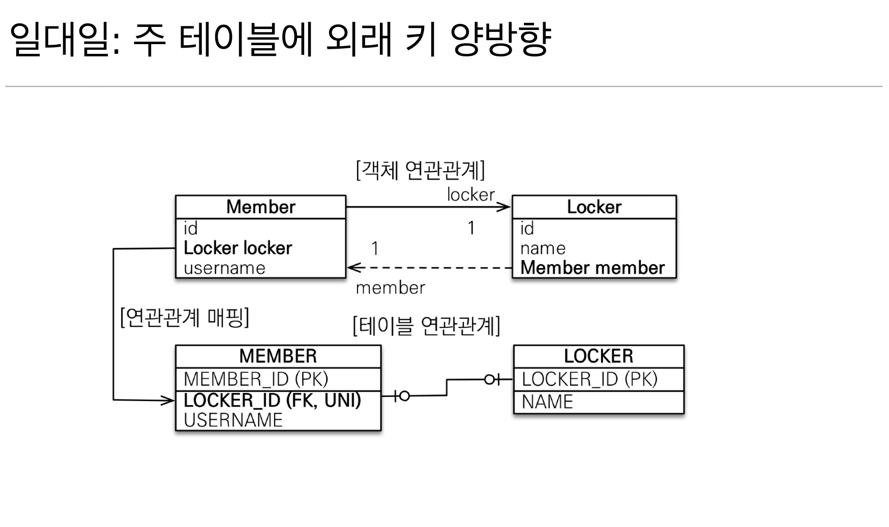
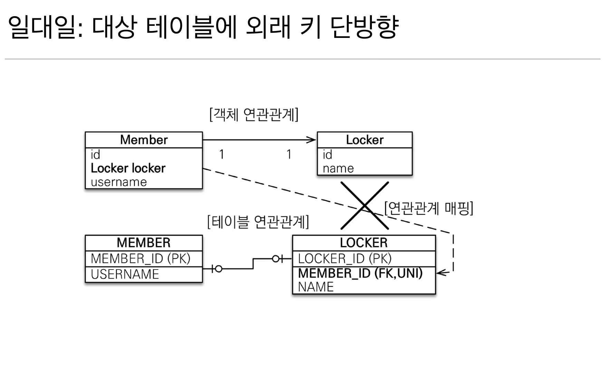
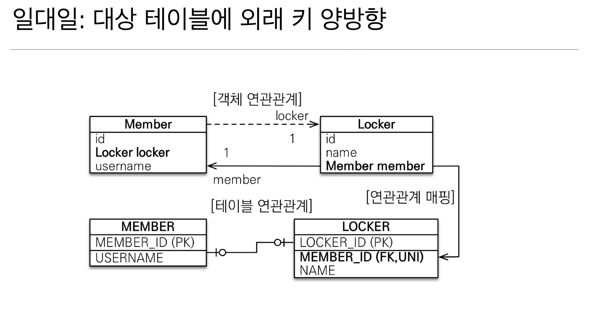

## 연관 관계의 주인

**테이블은** 외래 키 하나로 두 테이블이 연관 관계를 맺음 (JOIN)

**객체의** 양방향 관계는 A → B, B → A 처럼 참조가 2군데 필요

**연관관계 주인 규칙**

- 객체의 양방향 관계에서는 둘 중 하나가 테이블의 외래 키를 관리해야 한다
- **외래 키를 관리하는 쪽이 연관관계의 주인**
- **주인의 반대편은** 외래 키에 영향을 주지 않으며, 단순 조회만 가능

## 1. 다대일 (N:1)

---
### **다대일 단방향 (**’다’ 가 연관관계 주인)

- `Member : Team = N : 1`
- 다(N)에 해당하는 Member 가 `TEAM_ID(FK)`를 가지고 관리
- 가장 많이 사용하는 관계

### **다대일 양방향** (’다’ 가 연관관계 주인)

- 다대일 단방향에서 역방향 참조를 추가한 형태
- 외래 키를 가진 쪽(Member)이 연관 관계의 주인
- 반대편(Team)에서는 조회만 가능하다

## 2. 일대다(1:N)

---

### 일대다 단방향의 문제점


위 예시에서 팀에서는 회원들 리스트를 관리하고. Member에는 team 정보가 없다

테이블에서 외래 키(TEAM_ID)는 반드시 N쪽 (MEMBER) 테이블에 위치

Team 객체를 수정했는데, Member 테이블에 UPDATE 되는 혼란스러운 상황 발생

```java
@Entity
public class Team {

	@Id
	@GeneratedValue
	@Column(name = "TEAM_ID")
	private Long id;

	private String name;
	
	@OneToMany
	@JoinColumn(name = "TEAM_ID") // 일대다 단방향
	private List<Member> members = new ArrayList<>();
}
```

```java
// 회원 저장
Member member = new Member();
member.setUsername("member1");
em.persist(member); // 1. Member INSERT (TEAM_ID = null)

// 팀 저장
Team team = new Team();
team.setName("Team A");
team.getMembers().add(member);
em.persist(team); // 2. Team INSERT + Member UPDATE
```

1. Member INSERT 시 TEAM_ID가 null
2. Team을 저장하면서 추가 UPDATE 쿼리 발생
3. 코드상으로는 Team을 건드렸는데 Member 테이블이 수정됨

일대다 단방향의 단점

- 엔티티가 관리하는 외래 키가 다른 테이블에 있음
- 연관관계 관리를 위한 추가 UPDATE 쿼리 실행
- 코드의 직관성이 떨어짐
- @JoinColumn을 반드시 사용해야 함

**권장사항**

Member에서 Team을 조회할 일이 없더라도, 다대일 관계를 유지하는 것이 낫다

## 3. 일대일 (1:1)

---
### 일대일 단방향 (주 테이블에 외래키)


- Member 테이블에 LOCKER_ID 외래키 보유
- Member 객체에서 Locker 참조
- 다대일 단방향 매핑과 유사한 구조

### 일대일 양방향 (주 테이블에 외래 키)


- Locker 클래스에 Member 필드만 추가하면 끝
- 외래키가 있는 곳(Member)이 연관관계 주인
- 반대편(Locker)에 `mappedBy` 적용

### 일대일 단방향 (대상 테이블에 외래키) → 지원하지 않음


- Locker **테이블**에 `MEMBER_ID` 가 있지만, Locker **객체**는 Member를 접근할 수 없는 구조

→ JPA가 지원하지 않음

### 일대일 양방향 (대상 테이블에 외래키)


- 양쪽 객체에 모두 참조 필드 추가
- LOCKER 테이블에서 MEMBER_ID 외래 키 관리

## 4. 다대다 (N:M) - 실무 사용 금지

---
**다대다의 한계**

- 관계형 데이터베이스는 정규화된 테이블 2개로 다대다 관계 표현 불가능
- 연결 테이블을 추가해서 일대다, 다대일 관계로 풀어내야 함

**주요 문제점**

- 중간 테이블에 필드 추가가 불가능함 (생성 시간, 마지막 수정 시간 등등)
- 예상 못한 복잡한 쿼리 발생하는 경우
- 중간 테이블이 숨겨져 있어서 디버깅 어려움

해결책

중간 테이블에 해당하는 엔티티를 만들어서 사용하기