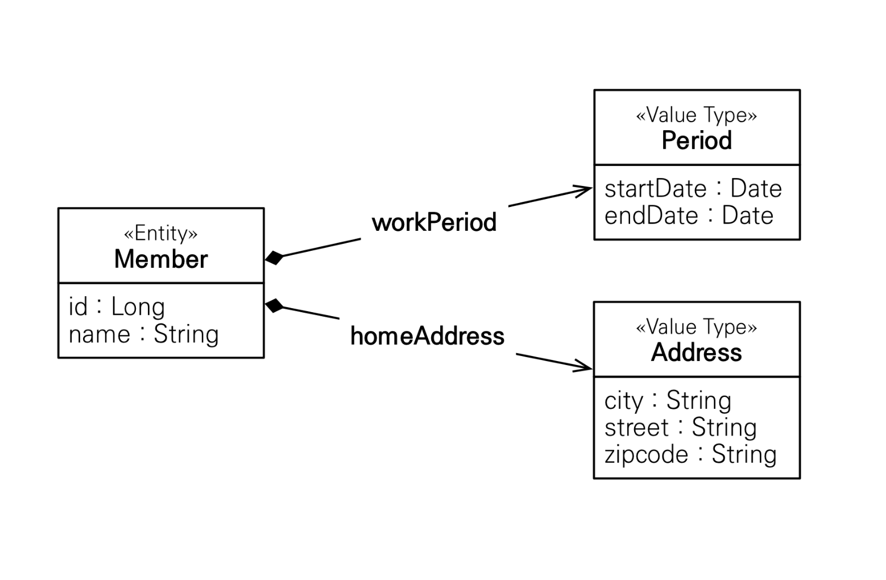
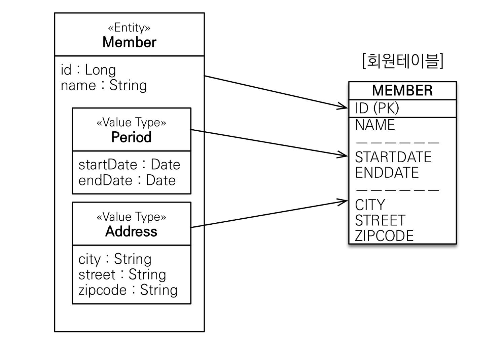
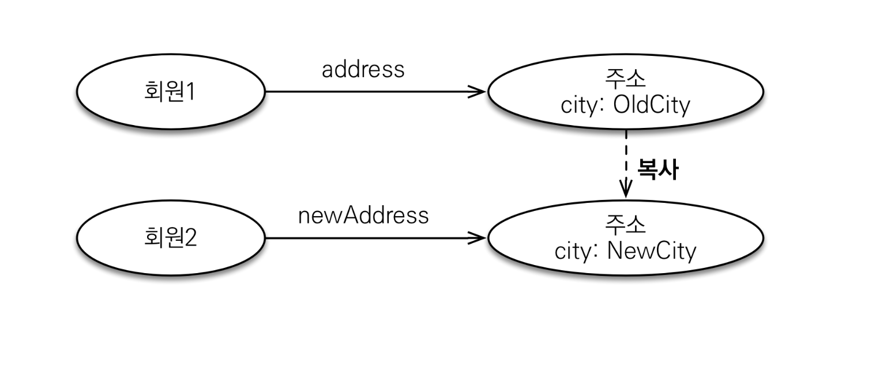
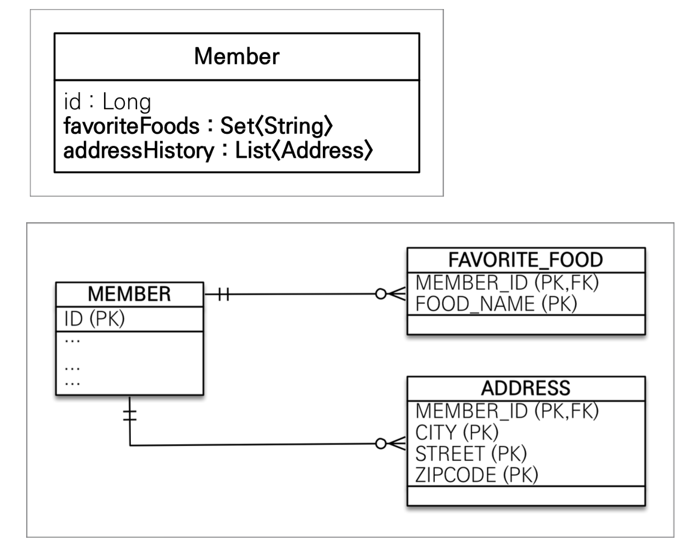
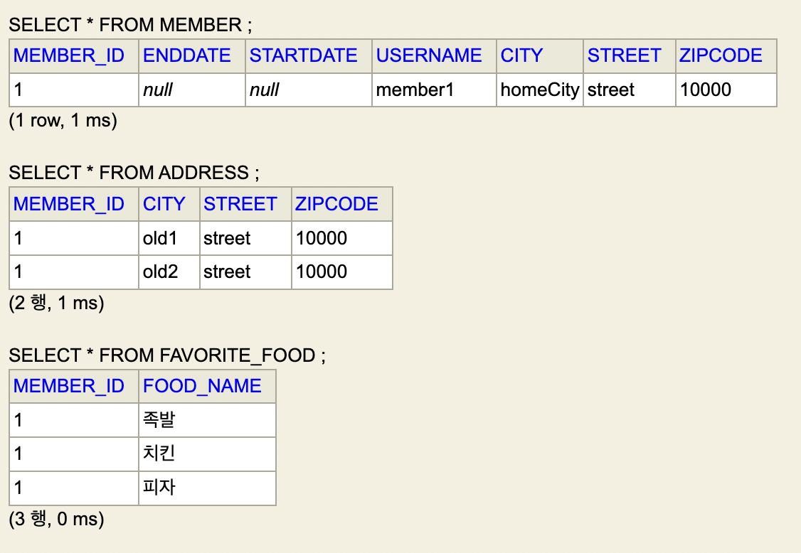
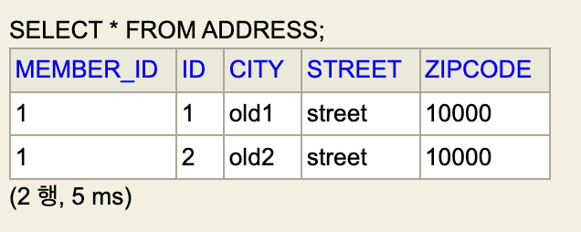

### **엔티티 타입**

@Entity로 정의하는 객체

데이터가 변해도 식별자로 지속해서 추적 가능

ex) 회원의 키, 나이, 이름 등이 바뀌어도 같은 ID를 가지면 같은 객체로 인식

### **값 타입**

int, Integer, String과 같이 값만을 가지는 자바 타입

식별자가 없고, 변경 시 추적 불가

ex) 숫자 100을 200으로 변경하면 완전히 다른 값으로 간주됨

**✅ 값 타입의 종류**

1. 기본값 타입
    - 자바 기본 타입(int, double)
    - 래퍼 클래스(Integer, Long)
    - String
2. 임베디드 타입 (embedded type, 복합 값 타입)
3. 컬렉션 값 타입 (collection value type)

## 1️⃣ 기본 값 타입

---

ex) String name, int age

생명주기를 엔티티에 의존한다

- 회원 삭제 시 이름, 나이도 함께 삭제


### ⚠️ 값 타입은 공유하면 안 됨

- 이름 변경시 다른 회원의 이름까지 바뀌면 안 됨
- 부작용 발생 위험

### 💡 자바의 **기본 값 타입**은 절대 공유되지 않는다

- int, double 같은 기본 타입(primitive type)은 절대 공유되지 않고, 항상 값을 복사함
- Integer, String은 참조 값 복사지만 **불변 객체**이므로 안전함

## 2️⃣ 임베디드 타입(복합 값 타입)

---

새로운 값 타입을 직접 정의 가능

여러 기본 값 타입을 묶어 재사용 가능한 타입 생성

### ex) 회원 엔티티

- 이름
- 근무 시작일, 근무 종료일 → ‘근무 기간’ 이라는 임베디드 타입으로 묶기
- 주소 도시, 주소 번지, 주소 우편번호 →  ‘주소’ 라는 임베디드 타입으로 묶기


  

### ✅ 임베디드 타입의 장점

- 재사용이 가능하다
- 응집도가 높다
- `Period.isWork()` 의미있는 메소드 작성 가능
- 모든 값 타입은 값 타입을 소유한 엔티티에 생명 주기를 의존함

### ✅ 테이블 매핑

- 임베디드 타입 여부와 상관 없이 테이블 구조는 동일하다
- 객체적으로 표현 가능하다는 점에서 장점이다


  


```java
@Embeddable
public class Address {
	private String city;
	private String street;
	private String zipcode;
}

@Embeddable
public class Period {
	private LocalDateTime startDate;
	private LocalDateTime endDate;
}

@Entity
public class Member {
	@Id
	@GeneratedValue
	private Long id;

	private String username;

	@Embedded
	private Period workPeriod;

	@Embedded
	private Address homeAddress;
}
```

### 한 엔티티에서 같은 값 타입을 2개 이상 사용하는 경우

`@AttributeOverrides`, `@AttributeOverride` 를 사용해 컬럼 명 속성을 바꿔주자

```java
	@Embedded
	private Address homeAddress;

	@Embedded
	@AttributeOverrides({
		@AttributeOverride(name = "city",
			column = @Column(name = "WORK_CITY")),
		@AttributeOverride(name = "street",
			column = @Column(name = "WORK_STREET")),
		@AttributeOverride(name = "zipcode",
			column = @Column(name = "WORK_ZIPCODE"))
	})
	private Address workAddress;
```

### 💡 임베디드 타입의 불가피한 공유참조

기본 타입과 다르게 객체 타입은 참조 값을 직접 대입해 공유 참조가 발생한다

**임베디드 타입**은 객체 타입이기 때문에 공유 참조가 발생할 수 있다

회원 A와 B가 같은 Address 인스턴스를 공유하면

→ 회원 B가 주소 변경 시 A의 주소도 변경됨

즉, 불변 객체로 만들어야 한다 !

  

### 불변 객체란?

생성 시점 이후 절대 값을 변경할 수 없는 객체

생성자로만 값을 설정하고, 수정자를 열어놓지 않는다

값 변경을 막아 부작용을 방지할 수 있다

→ 값 타입은 반드시 불변 객체로 만들어야 한다

### 값 타입의 비교

1. 동일성(identity) 비교
- == 사용
- 인스턴스의 참조 값을 비교

1. 동등성(equivalence) 비교
- eqauls() 사용
- 인스턴스의 값을 비교

**💡 값 타입은 반드시 .equals()를 재정의해 사용해야 한다**

## 3️⃣ 값 타입 컬렉션

---

값 타입을 하나 이상 저장할 때 사용하는 방식

ex) `List<String>`, `List<Address>`

JPA에서는 `@ElementCollection`, `@CollectionTable` 을 통해 매핑한다

관계형 DB는 일대다 컬렉션을 하나의 테이블에 저장하지 못하므로

별도의 테이블로 분리해서 관리해야 한다




### ex) 회원 엔티티

```java
@Entity
public class Member {

	@Embedded
	private Address homeAddress;

	@ElementCollection
	@CollectionTable(name = "**FAVORITE_FOOD**", joinColumns =	@JoinColumn(name = "**MEMBER_ID**"))
	@Column(name = "**FOOD_NAME**") // String은 필드가 하나여서 설정 가능
	private Set<String> favoriteFoods = new HashSet<>();

	@ElementCollection
	@CollectionTable(name = "**ADDRESS**", joinColumns =	@JoinColumn(name = "**MEMBER_ID**"))
	private List<Address> addressHistory = new ArrayList<>();
}
```

**📍생성되는 테이블**

```sql
Hibernate: 
    create table **ADDRESS** (
        **MEMBER_ID** bigint not null, // 회원 식별자를 외래 키로 가짐
        city varchar(255),
        street varchar(255),
        zipcode varchar(255)
    )
Hibernate: 
    create table **FAVORITE_FOOD** (
        **MEMBER_ID** bigint not null, // 회원 식별자를 외래 키로 가짐
        **FOOD_NAME** varchar(255)
    )
```

**📍값 저장 예시**

```sql
Member member = new Member();
member.setUsername("member1");
member.setHomeAddress(new Address("homeCity", "street", "10000"));

member.getFavoriteFoods().add("치킨");
member.getFavoriteFoods().add("족발");
member.getFavoriteFoods().add("피자");

member.getAddressHistory().add(new Address("old1", "street", "10000"));
member.getAddressHistory().add(new Address("old2", "street", "10000"));

em.persist(member);
```



### 값 타입 컬렉션 특징

값 타입 컬렉션은 자신을 소유한 엔티티에 생명주기를 의존한다

- 영속성 전이 (cascade)와 고아 객체 제거 기능을 필수로 가짐


지연 로딩(LAZY) 전략을 기본으로 한다

- 값에 접근하는 시점에 데이터베이스에서 조회


엔티티와 마찬가지로, 값 타입 컬렉션도 변경 감지가 가능하다

회원의 주소와 최애 음식을 수정해보자

```java
Member findMember = em.find(Member.class, member.getId());

// 기존 homeAddress를 새로운 Address 인스턴스로 교체
Address a = findMember.getHomeAddress();
findMember.setHomeAddress(new Address("new City", a.getStreet(), a.getZipcode()));

// 음식 교체
findMember.getFavoriteFoods().remove("치킨");
findMember.getFavoriteFoods().add("한식");

tx.commit();
```

컬렉션 내부 값이 변경되면, 변경된 내용만 반영되기보다는

기존 데이터를 삭제하고 새로 저장하는 방식으로 처리된다

### 값 타입 컬렉션의 제약사항

값 타입은 식별자가 없기 때문에 변경 추적이 어렵다

컬렉션 내 값이 변경되면 전체 컬렉션을 삭제하고 다시 저장한다

값 타입 컬렉션 테이블은 다음 제약을 따라야 한다

- 모든 컬럼으로 기본 키 구성
- NULL 금지
- 중복 저장 금지

### 실무에서 대안: 값 타입 컬렉션 → 엔티티 변환

값 타입 컬렉션의 한계를 극복하기 위해

일대다 엔티티 관계를 사용하는 방식이 실무에서 더 자주 쓰임

**📍ex) AddressEntity**

```java
@Entity
@Table(name = "ADDRESS")
public class AddressEntity {

	@Id	@GeneratedValue
	private Long id;

	private Address address; // 엔티티 내부에서 값 타입 사용

	public AddressEntity() {}

	public AddressEntity(String city, String street, String zipcode) {
		this.id = id;
		this.address = new Address(city, street, zipcode);
	}
```

**📍 Member 엔티티**

```java
@Entity
public class Member {

	// 생략
	
  @OneToMany(cascade = CascadeType.ALL, orphanRemoval = true)
	@JoinColumn(name = "MEMBER_ID")
	private List<**AddressEntity**> addressHistory = new ArrayList<>();
```

```java
member.getAddressHistory().add(new AddressEntity("old1", "street", "10000"));
member.getAddressHistory().add(new AddressEntity("old2", "street", "10000"));
```



이렇게 하면 각 AddressEntity가 고유 식별자를 가지며

엔티티로 관리되기 때문에 변경 추적과 관리가 용이하다

## ✅ 정리

---

### 엔티티 타입

- 식별자가 있다
- 생명 주기 독립적
- 공유 가능

### 값 타입

- 식별자가 없다
- 생명주기를 엔티티에 의존한다
- 공유하지 않는 것이 안전(복사해서 사용)
- 불변 객체로 만드는 것이 안전하다

### Tip

값 타입은 정말 값처럼만 사용할때에만 사용해야 한다

식별자가 필요하고, 지속적으로 값을 추적해야하고, 변경해야 한다면 엔티티로 정의해야 한다