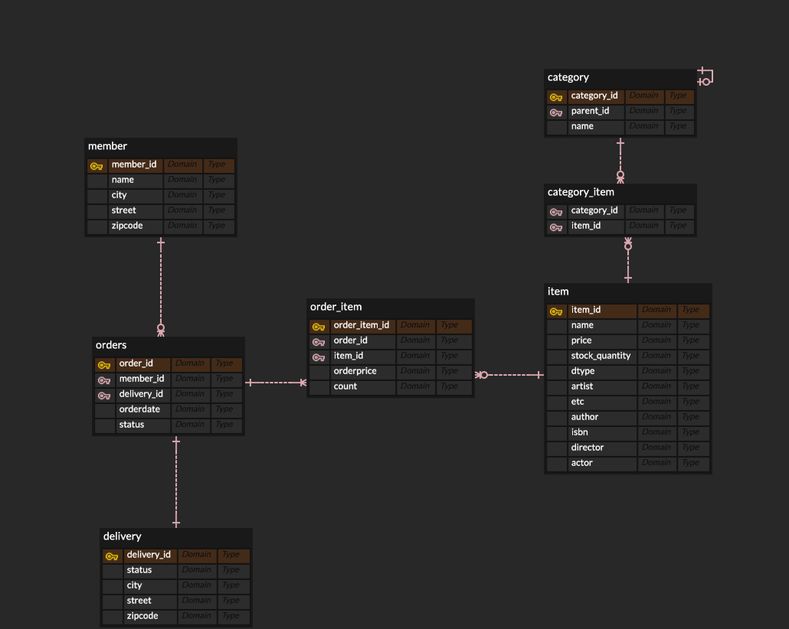

### E-R Diagram


## **연관관계 매핑**

- 연관관계의 개념은 객체지향 프로그래밍과 관계형 DB의 구조적 차이에서 출발한다
- 객체는 참조를 통해서 관계를 맺지만, DB는 외래 키(FK)로 관계를 맺는다
- JPA는 외래 키가 있는 쪽을 연관관계의 주인으로 지정해서 이 차이를 해결한다

## 연관관계 매핑 예제

### **1. 회원(Member) ↔ 주문(Order)**

- **관계**: 1:N 양방향
- **외래 키 위치**: 주문 테이블(order.member_id)
- **연관관계의 주인**: 주문(Order)
- 주문(Order) 테이블이 외래 키를 가지므로 연관관계의 주인으로 설정

```java
// Order 클래스
@ManyToOne(fetch = LAZY)
@JoinColumn(name = "member_id") // 외래 키 member_id
private Member member;

// Member 클래스
@OneToMany(mappedBy = "member") // Order의 member 필드에 의해 매핑됨을 의미 (비주인)
private List<Order> orders = new ArrayList<>();
```

---

### **2. 주문(Order) ↔ 주문상품(OrderItem)**

- **관계**: 1:N 양방향
- **외래 키 위치**: 주문상품 테이블(order_item.order_id)
- **연관관계의 주인**: 주문상품(OrderItem)
- 주문상품이 외래 키를 가지므로 연관관계의 주인으로 설정

```java
// OrderItem 클래스
@ManyToOne(fetch = LAZY)
@JoinColumn(name = "order_id") // 외래 키 order_id
private Order order;

// Order 클래스
@OneToMany(mappedBy = "order", cascade = CascadeType.ALL) // OrderItem의 order 필드에 의해 매핑됨을 의미 (비주인)
private List<OrderItem> orderItems = new ArrayList<>();
```

- `cascade = CascadeType.ALL`
    - 부모 엔티티에 대한 영속성 전이 가능
    - Order를 저장할 때 내부의 OrderItem도 함께 저장/삭제 가능

---

### **3. 주문상품(OrderItem) → 상품(Item)**

- **관계**: N:1 단방향
- **외래 키 위치**: 주문상품 테이블(order_item.item_id)
- **연관관계의 주인**: 주문상품(OrderItem)
- 상품(Item)은 외래 키를 가지지 않으므로 반대 매핑 없음

---

### **4. 주문(Order) ↔ 배송(Delivery)**

- **관계**: 1:1 양방향
- **외래 키 위치**: 주문 테이블(order.delivery_id)
- **연관관계의 주인**: 주문(Order)
- 주문이 외래 키를 가지므로 연관관계의 주인으로 설정

```java
// Order 클래스
@OneToOne(fetch = LAZY, cascade = CascadeType.ALL)
@JoinColumn(name = "delivery_id") // 외래 키 delivery_id
private Delivery delivery;

// Delivery 클래스
@OneToOne(mappedBy = "delivery") // Order의 delivery 필드에 의해 매핑됨을 의미 (비주인)
private Order order;
```

- `cascade = CascadeType.ALL`
    - Order를 저장할 때 내부의 Delivery도 함께 저장/삭제 가능

---

### **5. 상품(Item) ↔ 카테고리(Category)**

- **관계**: N:N
- **매핑**: @ManyToMany 사용 (중간 테이블 자동 생성)
- 실무에서는 **중간 엔티티**(ex. CategoryItem)를 두는 것을 권장

```java
@ManyToMany
@JoinTable(name = "category_item",
    joinColumns = @JoinColumn(name = "category_id"),
    inverseJoinColumns = @JoinColumn(name = "item_id"))
private List<Item> items;
```

---

## 연관관계 주인의 개념

```java
// 연관관계의 주인은 Order
order.setMember(member); // JPA가 DB의 FK(member_id)를 업데이트함
member.getOrders().add(order); // 비주인이라 DB 반영 안 됨
```

- 외래 키를 가진 쪽이 주인 (Order)
- 비주인 쪽은 (mappedBy) 읽기 전용 (거울 역할)
- 양쪽에 값을 넣었지만, JPA는 주인 쪽만 보고 INSERT/UPDATE 쿼리를 날림
    - JPA가 비주인은 읽기 전용이라고 생각함

---

## Fetch 전략

- 모든 연관관계는 **LAZY(지연로딩)**을 기본으로 설정해야 함
- EAGER(즉시로딩)은 N+1 문제 발생 가능
- 함께 조회가 필요한 경우 fetch join을 사용

### 즉시 로딩(EAGER)에서 N+1 문제가 발생하는 경우

```java
@Entity
public class Order {
    @ManyToOne // 기본이 EAGER
    private Member member;

    @OneToMany(mappedBy = "order")
    private List<OrderItem> orderItems = new ArrayList<>();
}
```

**JPQL**

```java
List<Order> orders = em.createQuery("select o from Order o", Order.class)
		.getResultList();
```

**이때 벌어지는 일**

1. select o from Order o → Order만 한 번에 조회 (쿼리 1번)
2. 각 Order가 연관된 Member를 즉시 로딩 → Order가 N개면 Member도 N번 조회됨

Order 수(N)만큼 쿼리가 추가로 나가서

쿼리는 총 1 + N번 나가게 된다

### 지연로딩 설정하게 되면

- Order를 조회할 때 연관된 Member는 처음에는 **실제 객체가 아닌 프록시 객체**로 설정되어, DB에서 조회되지 않는다
- 조회되기 전까지는 내부 필드 값이 null이거나 가짜 값
- Member 데이터를 포함하지 않고, getMember() 등으로 접근하는 순간에 DB에서 Member를 조회한다

```java
Order order = em.find(Order.class, 1L); // 아직 member에 대한 쿼리는 나가지 않음

Member member = order.getMember(); // 이 순간 member 조회 쿼리 나감
```

주의

- 프록시 객체는 영속성 컨텍스트가 있어야 초기화 가능하다
    - 트랜잭션이 끝난 후(@Transactional 바깥) getMember()를 호출하면 LazyInitializationException이 터짐

```java
@Transactional
public void test() {
	Order order = orderRepository.findById(1L).get();
	Member member = order.getMember(); // OK
}

public void test2() { // 트랜잭션이 걸려있지 않음
	Order order = orderRepository.findById(1L).get();
	Member member = order.getMember(); // LazyInitializationException 예외 발생
}
```

---

## Enum

- 반드시 `@Enumerated(EnumType.STRING)` 사용
- 기본값인 ORDINAL은 숫자로 저장되기 때문에 순서가 바뀌면 문제가 발생함

---

## 연관관계 편의 메서드

- 연관관계 설정을 양쪽에서 동시에 처리하는 메서드

```java
	// Order 클래스
	//==연관관계 편의 메서드==//
	
	public void setMember(Member member) {
		this.member = member;
		member.getOrders().add(this);
	}

	public void setOrderItem(OrderItem orderItem) {
		orderItems.add(orderItem);
		orderItem.setOrder(this);
	}

	public void setDelivery(Delivery delivery) {
		this.delivery = delivery;
		delivery.setOrder(this);
	}
}
```
